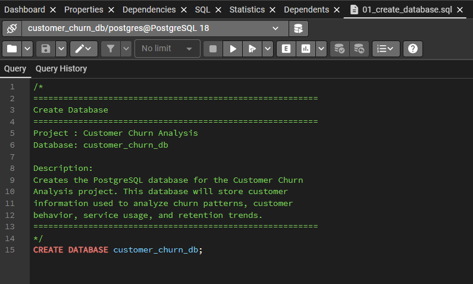
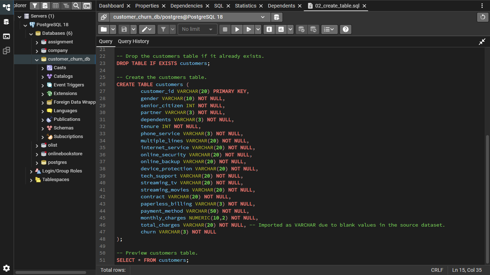
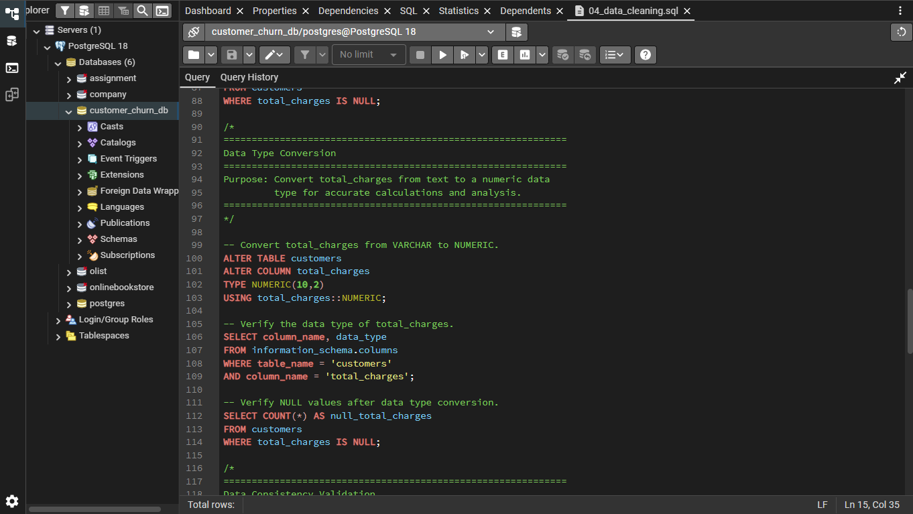
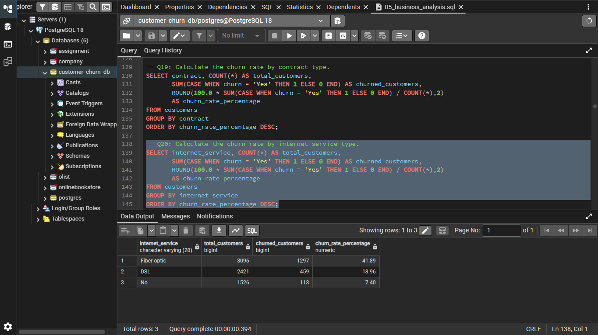
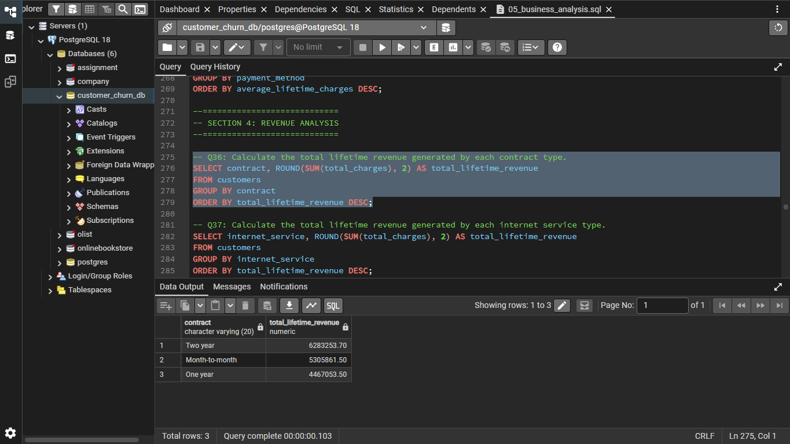
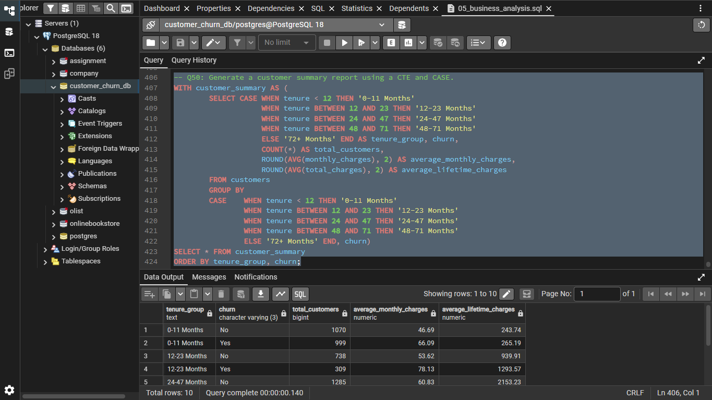

# Customer Churn Analysis using PostgreSQL

## 📌 Project Overview

This project analyzes the **IBM Telco Customer Churn Dataset** using **PostgreSQL** to uncover customer churn patterns, revenue trends, customer demographics, service usage, and payment behavior.

The project follows a complete SQL analytics workflow, including database creation, data import, data cleaning, validation, exploratory data analysis, and advanced SQL techniques to generate business insights.

---

## 🎯 Objectives

- Build a structured PostgreSQL database from a raw CSV dataset.
- Clean and validate customer data before analysis.
- Analyze customer churn and identify key business trends.
- Demonstrate SQL skills through real-world business questions.
- Build a GitHub-ready portfolio project for Data Analyst roles.

---

## 🛠️ Tools & Technologies

- **Database:** PostgreSQL
- **SQL Client:** pgAdmin 4
- **Language:** SQL
- **Dataset:** IBM Telco Customer Churn Dataset

---

## 📂 Project Structure

```
Customer-Churn-SQL-Analysis/
│
├── Dataset/
│   └── Telco-Customer-Churn.csv
│
├── SQL/
│   ├── 01_create_database.sql
│   ├── 02_create_table.sql
│   ├── 03_import_data.sql
│   ├── 04_data_cleaning.sql
│   └── 05_business_analysis.sql
│
├── screenshots/
│   ├── 01_database_created.png
│   ├── 02_table_schema.png
│   ├── 03_data_cleaning.png
│   ├── 04_customer_churn_analysis.png
│   ├── 05_revenue_analysis.png
│   └── 06_advanced_sql.png
│
└── README.md
```

---

## 📊 Dataset Information

| Attribute | Value |
|-----------|-------|
| Dataset | IBM Telco Customer Churn Dataset |
| Records | 7,043 Customers |
| Columns | 21 |
| Database | PostgreSQL |

The dataset contains customer demographic information, subscribed services, billing details, contract information, payment methods, and churn status.

---

## 🧹 Data Cleaning & Validation

The data preparation process included:

- Data overview
- Duplicate record check
- Missing value detection
- Handling whitespace values
- Converting blank values to `NULL`
- Converting `total_charges` from `VARCHAR` to `NUMERIC(10,2)`
- Data consistency validation
- Final quality validation

---

## 📈 Business Analysis

The project contains **50 SQL business questions**, including:

### Database Overview
- Customer distribution
- Revenue overview
- Contract analysis
- Internet service analysis
- Payment method analysis

### Customer Churn Analysis
- Churn rate by:
  - Gender
  - Senior Citizen
  - Partner
  - Dependents
  - Contract
  - Internet Service
  - Payment Method
  - Paperless Billing
  - Phone Service
  - Multiple Lines
  - Online Security
  - Online Backup
  - Device Protection
  - Tech Support
  - Streaming TV
  - Streaming Movies

### Revenue Analysis
- Monthly revenue
- Lifetime revenue
- Revenue by contract
- Revenue by payment method
- Revenue by internet service
- Estimated revenue lost due to churn

### Advanced SQL
- CASE Expressions
- Common Table Expressions (CTEs)
- RANK()
- DENSE_RANK()
- NTILE()
- ROW_NUMBER()

---

## 💡 SQL Concepts Demonstrated

- SELECT
- WHERE
- GROUP BY
- ORDER BY
- Aggregate Functions
- CASE Expressions
- Common Table Expressions (CTEs)
- Window Functions
  - RANK()
  - DENSE_RANK()
  - NTILE()
  - ROW_NUMBER()
- Data Cleaning
- Data Validation
- Data Type Conversion
- Business Analysis

---

## 📷 Project Screenshots

### Database Created



---

### Customer Table Schema



---

### Data Cleaning & Validation



---

### Customer Churn Analysis



---

### Revenue Analysis



---

### Advanced SQL



---

## 🚀 How to Run

1. Execute `01_create_database.sql`
2. Execute `02_create_table.sql`
3. Update the CSV file path in `03_import_data.sql`
4. Import the dataset
5. Execute `04_data_cleaning.sql`
6. Execute `05_business_analysis.sql`

---

## 📌 Key Business Insights

- Customer churn varies significantly across contract types.
- Long-term contracts have substantially lower churn rates.
- Customers with higher monthly charges tend to exhibit higher churn.
- Payment methods and internet services influence churn behavior.
- SQL window functions and CTEs enable deeper customer segmentation and ranking.

---

## 👨‍💻 Author

**Soumyadip Sinha Roy**

- GitHub: https://github.com/soumyadip2907
- LinkedIn: https://www.linkedin.com/in/soumyadip-sinha-roy-a21467230/?skipRedirect=true

---

⭐ If you found this project interesting, feel free to star the repository.
